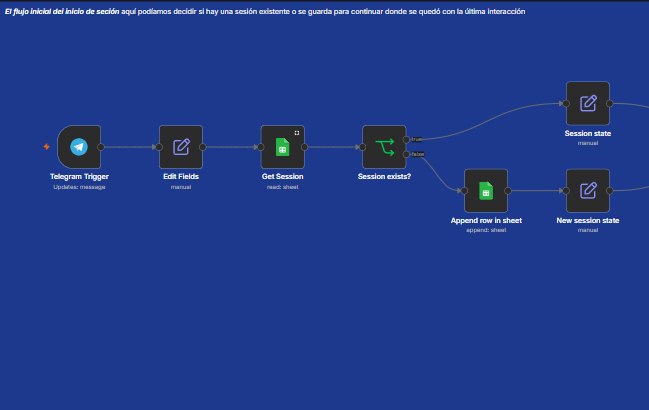
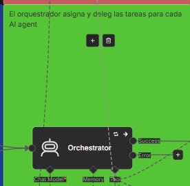
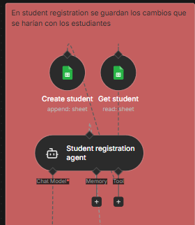
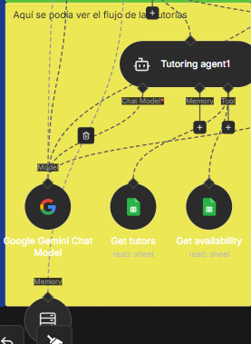
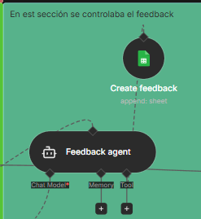
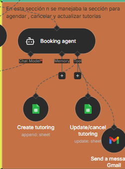
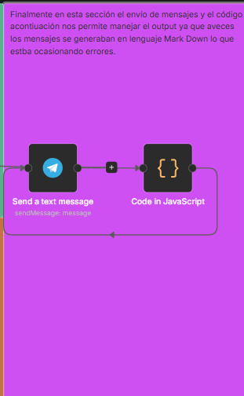

# TutorBot

TutorBot es un sistema automatizado para la gestión de tutorías académicas desarrollado con **n8n**. El proyecto integra **Telegram, Google Sheets, Gmail y agentes de IA** para permitir el registro de estudiantes, búsqueda de tutores, gestión de tutorías, notificaciones y seguimiento.

## ¿Qué aprendimos?

Es importante mantener un orden en todo momento, incluso antes de empezar a ejecutar el workflow, pueden haber muchas fallas para lo que uno debe diseñarlo primero como se hacen los wireframes para una aplicación. Al implementar los Agentes IA es importante que cada elemento tenga un nombre asignado porque los Agentes reconocen los nombres que se le asignan a cada elemento en el Worflow, entonces puede ser confuso si desde el principio no se tiene una buena arquitectura, y si no se tiene en cuenta el hecho de que tiene que asignarse un nombre específico en cada fase. Los temas principales dentro de este Worflow fueron:

- Diseñar workflows en **n8n**.
- Trabajar con **AI Agents** y herramientas.
- Integrar **Telegram** con n8n.
- Utilizar **Google Sheets** como base de datos.
- Automatizar correos mediante **Gmail**.
- Gestionar sesiones y conversaciones.
- Se implementó la modularización dentro del mismo workflow.
- 

Como en todo programa y este no es la excepción es importante que se trabaje la modularización con el objetivo de que sea escalable y puedan agregarse más elementos y más información en el futuro.

## Flujo del proyecto

Telegram
   ↓
Orchestrator
   ↓
AI Agents
   ↓
Google Sheets
   ↓
Gmail / Automatizaciones

1. Inicio: En esta primera parte del workflow se califica si el usuario es nuevo, o si tenía una sesión anteriormente. Esta sesiones se van almacenando en un spreadsheet para conservar el almacenamiento y consultarlo.

  

2. El "Orchestrator", es la segunda parte clave aún siendo un agente de IA no posee una tarea en específico, su objetivo principal en este workflow es delegar tareas a otros Agentes AI.

 

3. Student Registration Agent : En esta parte uno de los agentes de IA que si posee la tarea específica de registrar alumnos y consultar si hay alumnos existentes en la base de datos. 

  

4. Tutoring Agent: El agente de tutoría es el encargado de consultar y crear las tutorías en la base de datos. 

  

5. Booking Agent

  

6. Feedback y notificaciones

  

7. Envío de menaje: el código que lo acompaña es para asegurarse que el output del mensaje siempre sea el adecuado para evitar errores, por ejemplo, al principio ocasionaba errores porque estaba entregando un output de tipo MarkDown, lo que impedía que el Workflow terminara, y se quedara atrapado en un error.

  

7. Acceso de coordinación: si el usuario tiene acceso de coordinación entonces si se puede ejecutar los reportes mediante un nodo de condicional if, luego según la documentación del nodo de Summarize, tenemos que utilizar una base de datos, y luego agregar los valores por los cuales uno quiere obtener el resumen, agregue un filtro para poder extraer los datos específicamente de la semana, y luego se envío un mensaje con el contenido: 

